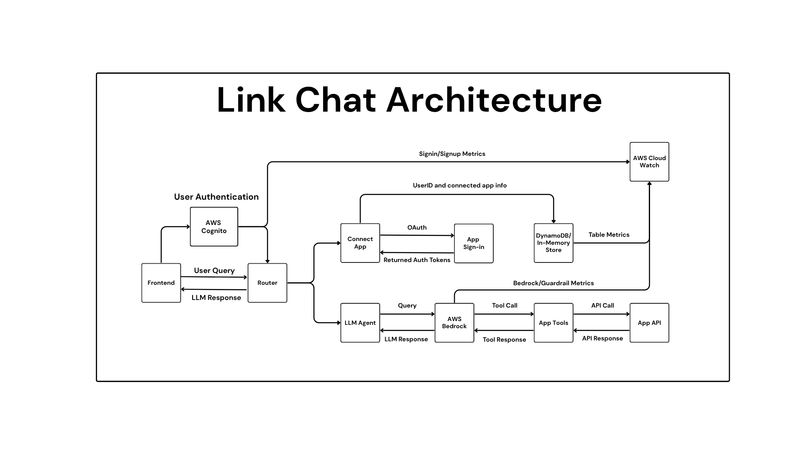

# Link

## Architecture Documentation

### Overview
This system is a chatbot that a user can connect external applications to and use as a personal assistant. It uses Claude's 3.5 haiku model and leverages AWS Bedrock for the chat interaction and tool calling functionality.

### Architecture Diagram



### AWS Service Images

#### Cloudwatch Dashboard


#### DynamoDB Schema


#### Bedrock Guardrails

- PII Guardrail


- Prompt Injection Guardrail


### Flow
1. A user can either sign-in or create an account which is authenticated through AWS Cognito
2. A user can either connect an application or begin chatting
3. If a user selects to connect apps, they will be sent to that app's respective authentication page before being redirected back to the site
5. From then on, the user can interact with the chatbot as normal. If a user decides to request an action from the chatbot that would require the use of that external application, link will handle that for the user
6. Logs are sent to CloudWatch from AWS Cognito and AWS Bedrock and DynamoDB for security and performance monitoring 

### Components

1. Frontend (Optional): 
    - React Native frontend 

2. Backend:
    - Amazon Cognito is used as the base for the authentication service
    - A router is used to connect to applications or chat with bedrock
    - AWS Bedrock/Anthropic's claude for the chat interactions
    - AWS DynamoDB to store apps the user has connected to
    - In-memory store for local caching of necessary information for faster processing
    - AWS Cloudwatch for monitoring and logging

### Requirements

1. Backend
```python
python-dotenv==1.1.0
requests==2.32.4
flask==3.1.1
flask-cors==6.0.1
pytest==8.4.0
pytest-cov==6.1.1
pydantic==2.11.5
pandas==2.3.0
boto3==1.38.41
```

2. Frontend
    - Node v23.11.0

### Model Configuration

2. Bedrock
    - Model: anthropic.claude-3-haiku-20240307-v1:0
    - Method: client.converse()
    - Schema enforcement: Tool dependent

## User Guide

### What It Does
This chatbot allows you to interact with a chatbot and use it as a personal assistant which can connect with external applications and perform actions.

### How to install

1. Clone this repository 
```bash
git clone https://github.com/notthattal/Link.git
cd Link
```

2. Create and activate a virtual environment
```bash
python -m venv venv
source venv/bin/activate
```

3. Install the requirements for the backend
```bash
pip install -r requirements.txt
```

4. Start the requirements for the frontend
```bash
cd frontend
npm install
``` 

5. Start the frontend
```bash
npm run dev
```

6. Start the backend *(In a new terminal pointing to the project root directory)*
```bash
python server.py
```

7. Run tests and test for coverage *(Optional)*
```bash
pytest --cov=.
```

### How to use

1. Create an account or sign-in
2. Verify your account (if first time signing in)
3. Select the gear in the top right and go to the ConnectApps page to select which apps you would like to use
4. Authenticate with the app you would like to use
5. Navigate back to the homepage and start chatting!

## Security Documentation

### API Key Management

- API keys are stored using environment variables.
- They are never hardcoded anywhere in source code or frontend files.

### Input Validation and Sanitization

- Inputs are schema-validated before processing.
- AWS Bedrock Guardrails are used to enforce prompt safety and block malicious instructions.
- Unsafe or malformed inputs are automatically handled via Bedrock’s `guardrailConfig` policies.

### Authentication and Authorization

- AWS Cognito handles all user authentication flows.
- Only verified users are allowed to invoke protected endpoints.

### Data Handling and Privacy

- User identity is tracked internally using the Cognito `sub` UUID only.
- All environment variables and credentials are scoped per environment and never exposed publicly.

### Safety Filters and Monitoring

- AWS Bedrock Guardrails apply real-time content moderation policies.
- All prompt/response flows are subject to Bedrock's safety filters.
- AWS CloudWatch is used to monitor API usage, latency, and access patterns.
- All authentication events and access attempts are tracked via CloudTrail for audit compliance.