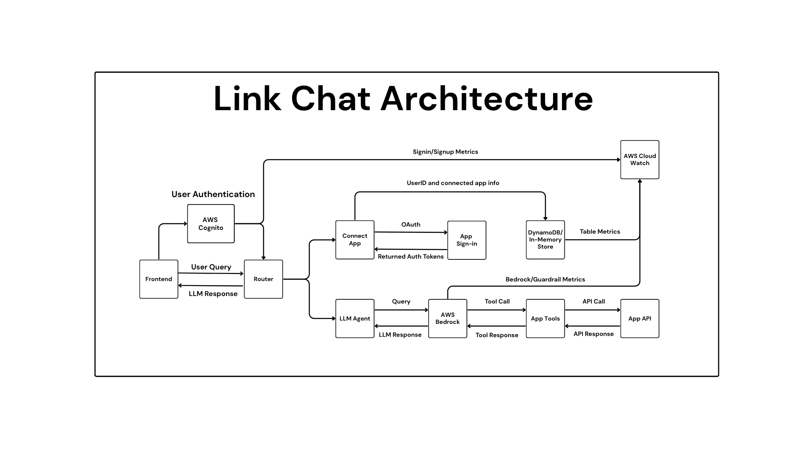

## Architecture Documentation: CharacterBot

### Overview
This system is a chatbot that a user can user to interact with a famous character of their choice or make up a persona to talk with. It uses OpenAI's gpt-4o-mini model with structured outputs to create the persona and leverages Amazon's proprietary chat model through Bedrock for the chat interaction.

### Architecture Diagram



### Flow
1. A user can either sign-in or create an account which is authenticated through AWS Cognito
2. A user is prompted to select any persona of their choosing
3. Their response is sent through the router to the Persona Agent to GPT to extract the persona and a description (through OpenAI's structured output feature) to be supplied to Bedrock
4. The user can begin chatting with the new persona
5. From then on, the user can interact with the chatbot as normal. All requests will be routed through API Gateway to the lambda that calls bedrock
6. Logs are sent to CloudWatch from AWS Cognito and AWS Lambda for security and performance monitoring 

### Components

1. Frontend (Optional): 
    - React Native frontend 

2. Backend:
    - Amazon Cognito is used as the base for the authentication service
    - A router is used to either send a prompt to the persona agent or to bedrock
    - API Gateway to interact with the lambda
    - AWS lambda to send requests to Bedrock
    - AWS Bedrock for the chat interactions
    - AWS Cloudwatch for monitoring and logging
    - OpenAI for persona determination

### Requirements

1. Backend
```python
openai==1.86.0
python-dotenv==1.1.0
requests==2.32.4
flask==3.1.1
flask-cors==6.0.1
pytest==8.4.0
pytest-cov==6.1.1
pydantic==2.11.5
```

2. Frontend
    - Node v23.11.0

### Model Configuration

1. OpenAI
    - Model: gpt-4o-mini
    - Method: beta.chat.completions.parse()
    - Schema enforcement: Via structured outputs

2. Bedrock
    - Model: amazon.nova-micro-v1:0
    - Method: bedrock.invoke_model()
    - Schema enforcement: None
